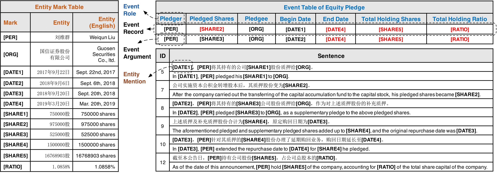
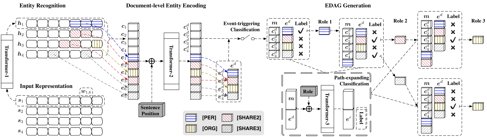

# Doc2EDAG

Source code for the paper,
["Doc2EDAG: An End-to-End Document-level Framework for Chinese Financial Event Extraction"](https://arxiv.org/abs/1904.07535),
in EMNLP 2019.


## Overview

**Document-level Event Extraction** (DEE) is urgently demanded in many applications but faces two major challenges:
- **Arguments-scattering**:
    arguments of a event record are always scattered across multiple sentences of a document.
- **Multi-event**:
    multiple event records with scattered arguments frequently coexists in one document.

Below we show an example to intuitively illustrate these two challenges.

<p align='center'>
    
</p>

To combat aforementioned challenges,
we propose a truly end-to-end model, **Doc2EDAG**, for DEE,
which can take a document as the input and directly emit event tables with multiple entries.

In general, the end-to-end DEE needs to complete the following tasks jointly:
- **Entity Extraction** (easy)
- **Event Triggering** (easy)
- **Event Table Filling** (hard)

How can Doc2EDAG achieve this?

It is owing to a novel structure, the **entity-based directed acyclic graph** (EDAG).
Instead of directly filling a table, Doc2EDAG just generates an EDAG in an auto-regressive manner.
In this way, a hard table filling task is decomposed into several path-expanding sub-tasks that are more tractable.

The following figure shows the overall architecture of Doc2EDAG, for more details, please refer to our paper.

<p align='center'>
    
</p>


## Dataset

We utilize financial announcements of listed companies in China from 2008 to 2018 
and build a large-scale dataset for DEE via distant supervision.

Run `unzip Data.zip`

## Usage

### Setup

Please use `Python 3(.6)` as well as the following packages:
```text
torch >= 1.0.0
pytorch-pretrained-bert == 0.4.0
tensorboardX
numpy
tqdm
```

### Training

For a machine with 8 GPUs, run
```bash
./train_multi.sh 8 --task_name [TASK_NAME]
```

If you want to use only 4 GPUs (Id 0,3,5,7), run
```bash
CUDA_VISIBLE_DEVICES=0,3,5,7 ./train_multi.sh 4 --task_name [TASK_NAME] --gradient_accumulation_steps 16
```

Please note that
- By setting a large step length of gradient accumulation, we can achieve large batch training with a few common GPUs.
Specifically, for Titan X (12GB Memory), you should maintain `B/(N*G) == 1`,
where `B`, `N` and `G` denote the batch size, the number of GPUs, and the step size of gradient accumulation, respectively.
- If you want to use BERT, just set `--use_bert True`, but using BERT requires much larger GPU memory
(at least 24GB, the more the better).

### Evaluation

To get evaluation results, run
```bash
./eval.sh --task_name [TASK_NAME] --eval_model_names DCFEE-O,DCFEE-M,GreedyDec,Doc2EDAG
```
You can run this evaluation script at any time after the start of training, 
and it will report the latest information.

### Reproducing Experiments

To reproduce all experiments reported in our paper, just run
```bash
./reprod_all_exps.sh
```
Please note that we assume you have 8 GPUs each with 12GB memory and the total runtime can be very long.


## Citation

If you find our work interesting, you can cite the paper as

```text
@inproceedings{zheng2019doc2edag,
               title={{Doc2EDAG}: An End-to-End Document-level Framework for Chinese Financial Event Extraction},
               author={Zheng, Shun and Cao, Wei and Xu, Wei and Bian, Jiang},
               booktitle={EMNLP},
               year={2019}
}
```


